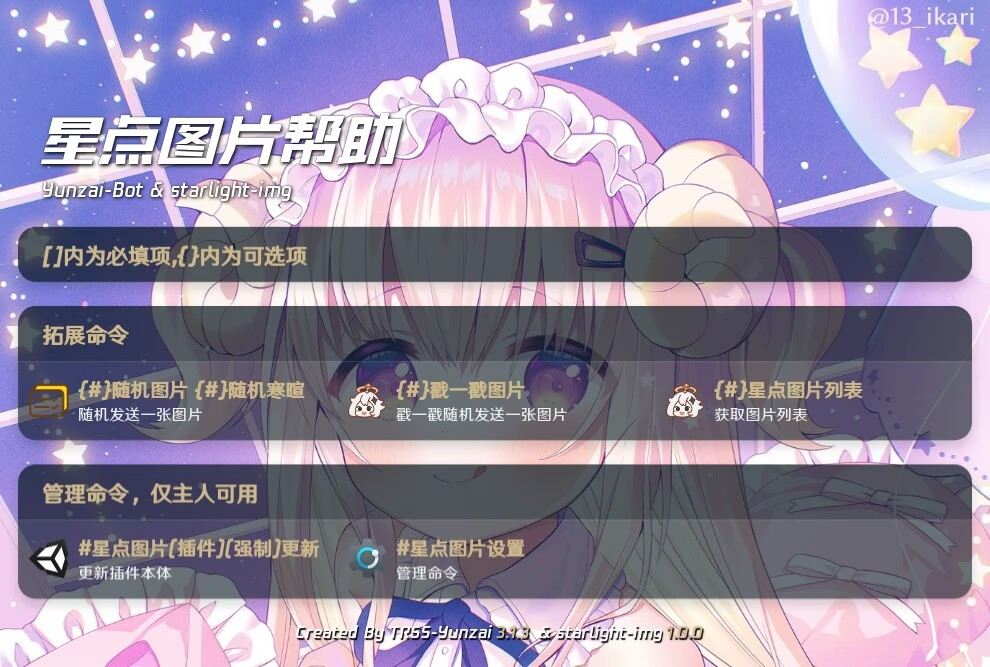

# <center>starlight-img</center>

<br>
[](https://github.com/wuliya336/starlight-img)[](https://github.com/wuliya336/starlight-img)[](https://gitee.com/Le-niao/Yunzai-Bot)<br>
starlight-img`是一个`Yunzai-Bot`的扩展插件，提供随机图片方案功能<br>

---

## 安装与更新

### 使用Git安装（推荐）

#### **使用Github**

```
git clone --depth=1 https://github.com/wuliya336/starlight-img ./plugins/starlight-img/
```

```
pnpm install --filter=starlight-img
```

#### **使用GitHub镜像**

```
git clone --depth=1 https://gh.wuliya336.top/github.com/wuliya336/starlight-img ./plugins/starlight-img/
```

```
pnpm install --filter=starlight-img
```

### 手工下载安装（不推荐）

**手工下载安装包，解压后将`starlight-img-master`更名为`starlight-img`，然后放置在Yunzai的plugins目录内<br>**

**虽然此方式能够使用，不利于后续升级，故不推荐使用<br>**

---

## 使用帮助

对机器人发送`#星点图片帮助`


# 资源

- [Miao-Yunzai](https://github.com/yoimiya-kokomi/Miao-Yunzai) : 喵版Yunzai [Gitee](https://gitee.com/yoimiya-kokomi/Miao-Yunzai)
  / [Github](https://github.com/yoimiya-kokomi/Miao-Yunzai)
- [Yunzai-V3](https://github.com/yoimiya-kokomi/Yunzai-Bot) ：Yunzai V3 - 喵喵维护版（使用 icqq）
- [Yunzai-V3](https://gitee.com/Le-niao/Yunzai-Bot) ：Yunzai V3 - 乐神原版（使用 oicq）
